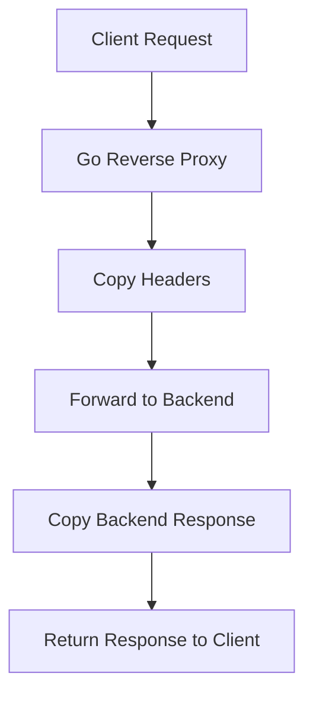

# Go Reverse Proxy

A lightweight reverse proxy built in Go with the standard `net/http` package. It listens for incoming HTTP requests, forwards them to a configured backend server, and returns the backend response to the client.

## Features
- Forwards HTTP requests to a configured backend target
- Copies request and response headers
- Adds common proxy headers such as `X-Forwarded-For`
- Supports configurable listen address, backend URL, and timeout
- No external libraries

## Resume Summary

**Reverse Proxy | Go, Networking**
- Built a lightweight reverse proxy in Go using `net/http` to forward incoming HTTP requests to a configured backend server.
- Implemented core proxy functionality including request forwarding, response handling, header propagation, and simple routing logic.
- Added configurable backend targets and timeout settings to support flexible proxy setup and reliable request handling.

## Run

```bash
go run . -listen :8080 -backend http://localhost:8081 -timeout 30s
```

Then send requests to the proxy:

```bash
curl http://localhost:8080
```

## Options

| Flag | Default | Description |
| --- | --- | --- |
| `-listen` | `:8080` | Address the proxy listens on |
| `-backend` | `http://localhost:8081` | Backend server to forward requests to |
| `-timeout` | `30s` | Request timeout for backend calls |

## Architecture


